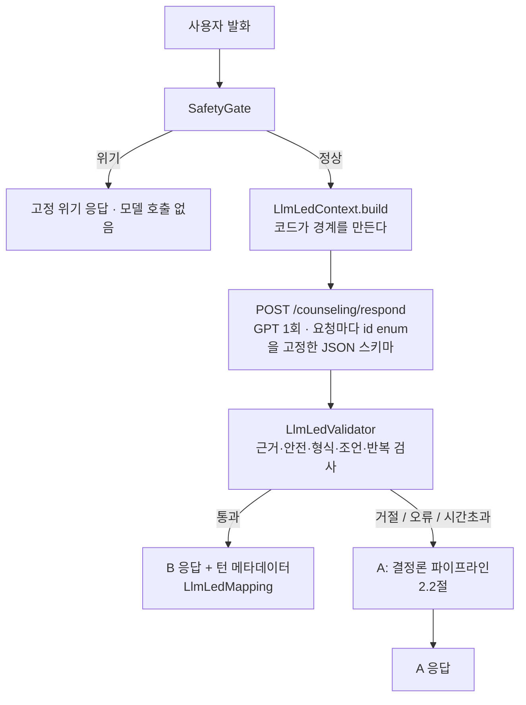
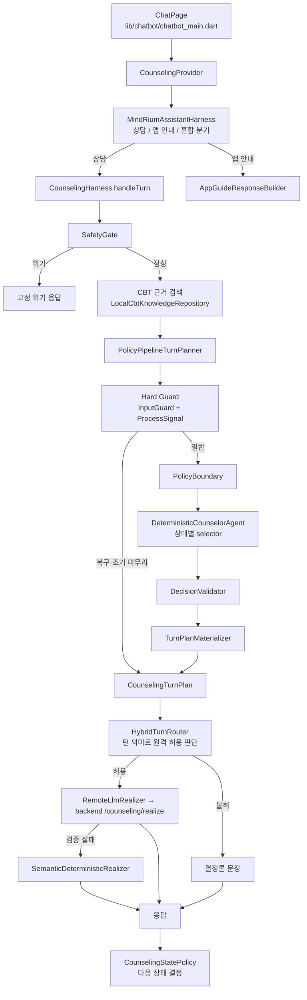

# Mindrium 디지털 CBT 상담 챗봇: 구조와 기능

기준: 2026-10-03, 데모 동결 태그 `respond-v11-demo-freeze`. 실행 방법과 인수인계 요약은
[`../HANDOVER.md`](../HANDOVER.md), 시연 절차는 [`../demo_checklist.md`](../demo_checklist.md)에 있습니다.
LLM 주도 경로(B)의 설계·평가 기록은 [`phase14x_bounded_llm_led.md`](phase14x_bounded_llm_led.md)에 있습니다.

이 기능은 의료 진단이나 전문 치료를 대체하지 않습니다. 안전 관문은 키워드 기반이고, 상담 문장과 위기 응답은
아직 임상 전문가의 검수를 받지 않았습니다. 외부 사용자에게 공개하기 전에 검수가 필요합니다.
사용자 발화를 OpenAI로 보내는 경로(B, 원격 표현)는 허용 목록에 있는 내부·데모 계정에서만 켜집니다.

---

## 1. 한눈에 보기

| 항목 | 내용 |
|---|---|
| 목적 | 범불안 CBT 프로그램(1~8주차) 사용자가 걱정 하나를 골라, 짧은 상담 세션에서 생각을 살펴보고 그 주차까지 배운 기법을 적용하도록 돕는다 |
| 대화 단위 | 세션 하나는 확인 → 탐색 → 되짚기 → 기법 → 마무리 순서로 진행하며, 보통 7~12턴이다 |
| 주 경로 (B) | **LLM이 허용된 경계 안에서 대화 전략과 응답을 정하고, 안전·사용자 사실·앱 사실·기법 자격·용어 정의·최종 검증은 코드가 통제한다** (Bounded LLM-led, 2절) |
| 대체 경로 (A) | B가 검증에 실패하거나 응답이 없으면, 그 턴은 결정론 파이프라인(상태, 목표, 기법, 대상을 코드가 결정)이 답한다. 허용 목록 밖의 계정은 처음부터 A만 쓴다 |
| 안전 | 위기 표현은 상담을 중단하고 고정된 위기 응답을 낸다 |
| 기법 | 승인된 4~8주차 기법만 사용한다. 현재 주차까지 누적해 쓰고, 미래 주차 기법은 쓰지 않는다 |
| 저장 | 세션 요약을 백엔드(`/counseling-sessions`)에 저장한다. 마무리가 확정되면 `completed`, 중간에 나가면 `interrupted` |

---

## 2. 전체 구조

### 2.1 두 경로 (데모 구성: `COUNSELING_LLM_LED_PATH=true`, 허용 목록 계정)



LLM 호출 전에 코드가 정하는 경계:
- **SafetyGate:** 위기면 모델을 부르지 않는다.
- **사용자 사실:** 일기, 과거 상담 에피소드, 효과 있었던 기법(id 포함). 모델은 이 id만 인용할 수 있다.
- **기법 자격:** 현재 주차까지의 승인 기법만 enum으로 준다.
- **앱 사실:** 앱 안내 지식(기능, 화면, 이동 경로, id 포함).
- **용어:** 사용자가 물은 용어를 코드가 판정하고(`TermGlossary`), 승인 코퍼스의 정의 하나만 준다.
- **회상:** 사용자가 과거를 언급하면("예전에도", "지난번") 코드가 주제가 겹치는 지난 완료 상담을 고른다(`RecallRequest`). 응답이 그 기록(걱정, 그때 정리한 생각)을 말하지 않으면 코드가 저장된 기록 그대로 회상 문장을 붙인다.
- **진행 근거:** 걱정 파악, 근거·관점 탐색, 탐색 종료(`explore_closed`), 최근 질문, 종료 요청, 새 주제 여부.

응답 뒤 검증기가 거절하는 것 (주요 항목): 승인되지 않은 기법, 주지 않은 사용자·앱 사실, 진단·결과 보장, 상담 지시·조언(`directive`, `advice`), 사용자가 시도하기 전의 예시 문장(`premature_example`), 질문 2개 이상, 반복 질문·반복 응답, 반말, 제안 없는 종료, 탐색 종료 후 같은 걱정 재탐색, 용어 정의 불일치. 거절 사유는 `LLM_LED` 로그에 남는다(텍스트 없음).

### 2.2 대체 경로 A (결정론 파이프라인)



**A 경로의 원칙** (B가 대체될 때와 허용 목록 밖 계정에 적용)
1. **결정과 표현의 분리.** 상태 전이, 질문 목표, 기법 선택, 인용 대상은 결정론 코드가 정합니다. GPT는 이미 정해진 계획의 문장만 다듬습니다.
2. **원격 GPT 허용은 턴의 의미가 정한다.** 상태가 아니라 턴의 종류로 판단합니다. 복구 턴, 목표 소진 대응, 조기 마무리 턴은 항상 결정론 문장으로 나갑니다.
3. **흐름은 검출보다 구조로 지킨다.** 메타 발화나 저정보 답을 알아보지 못해도, 인용·기법 인정·질문 반복을 막는 안전장치가 별도로 동작합니다(8절).

---

## 3. 디렉터리와 파일

### 3.1 상담 엔진 `lib/features/counseling/`

| 파일 | 역할 |
|---|---|
| `counseling_harness.dart` | 한 턴 처리의 진입점(`handleTurn`). 안전 관문 → 검색 → 계획 → 라우팅 → 실현 → 상태 전이. `deterministic()` / `remoteGpt()` 두 팩토리 |
| `counseling_provider.dart` | 화면과 harness를 잇는 상태 관리. 메시지 목록, 세션 저장(`completed`/`interrupted`), 종료 여부(`isSessionFinalized`) |
| `counseling_state.dart` | 상태 enum과 `CounselingStatePolicy`(단계별 예산, 최소 턴, 완료 기반 전이, 조기 마무리, 마무리 재개) |
| `turn_plan.dart` | `CounselingTurnPlan` 모델, Hard Guard 계층(`DeterministicInputGuardTurnPlanner`, `DeterministicProcessSignalTurnPlanner`), 상태별 결정론 planner |
| `intervention_registry.dart` | 승인 기법 목록(4~8주차)과 `policiesUpTo(week)` 누적 조회 |
| `hybrid_turn_router.dart` | 이번 턴에 원격 GPT를 써도 되는지 판단 |
| `remote_llm_realizer.dart`, `response_realizer.dart` | 원격 실현 요청·검증·결과 모델 |
| `safety_gate.dart` | `KeywordSafetyGate`(normal / elevated / crisis) |
| `surface_variation.dart` | 같은 문장이 연달아 나오지 않게 후보 문장을 고르는 장치 |
| `prompt_builder.dart`, `turn_plan_prompt_builder.dart`, `compact_prompt_builder.dart`, `output_parser.dart`, `llm_service.dart`, `mock_llm_service.dart` | 모델 입출력 계층. 현재 제품 경로에서는 결정론 초안과 원격 실현기가 주로 쓰고, 이 계층은 프롬프트 번들과 파싱을 맡는다 |
| `empathy_planner.dart`, `activity_recommendation.dart`, `counseling_benchmark.dart` | 즉시 공감 문장(현재 비활성), 기법별 앱 활동 추천, 개발용 지연 계측 |

### 3.2 정책 계층 `lib/features/counseling/policy/`

| 경로 | 역할 |
|---|---|
| `production_turn_planner.dart` | `PolicyPipelineTurnPlanner`: Hard Guard → 경계 → 에이전트 → 검증 → 실체화 |
| `policy_boundary.dart`, `policy_boundary_request.dart` | 이번 턴에 허용되는 행위, 목표 후보, 기법 후보(경계) |
| `deterministic_counselor_agent.dart`, `counselor_agent.dart` | 경계 안에서 결정을 고르는 에이전트 |
| `counselor_decision.dart`, `counselor_decision_validator.dart`, `decision_contract.dart` | 결정 모델, 검증, (상태, 행위)별 필수 필드 계약 |
| `selectors/` | 상태별 결정: `checkin`, `explore`, `reflect`, `intervention`, `closing` |
| `materializers/turn_plan_materializer.dart` | 결정을 실제 문장 계획으로 바꿈. 인용 규칙, 기법 문장, 통합 문장, 마무리 문장이 여기 있다 |
| `materializers/realization_spec_builder.dart`, `realization/` | 원격 실현용 의미 명세, 결정론 의미 실현기(원격 실패 시 대체) |
| `intervention_eligibility_predicates.dart` | 기법 후보 결정(`InterventionCandidateResolver`), 질문→답 추적(`InterventionProgressTracker`) |
| `turn_plan_adapter.dart` | 상태·행위별로 materializer 메서드를 고름 |
| `rollout/` | 단계적 공개 설정(`RolloutConfig`), 내부 계정 허용 목록(`internal_account_allowlist.dart`, B 경로와 원격 표현을 켜는 계정), 원격 실현 텔레메트리 |

### 3.1A B 경로 `lib/features/counseling/llm_led/`

| 파일 | 역할 |
|---|---|
| `llm_led_contract.dart` | `LlmLedContext`(경계 구성), `LlmLedOutput`(응답 파싱), `LlmLedValidator`(검증), `LlmLedMapping`(응답 → 다음 상태와 턴 메타데이터, 기법 인정은 코드 규칙) |
| `term_glossary.dart` | 용어 질문 판정. `assets/counseling/glossary.json`은 이름·별칭만 갖고, 정의는 승인 코퍼스에서 읽는다 |
| `../counseling_harness.dart` `handleLlmLedTurn` | 안전 → 경계 → 호출 → 검증. 실패하면 세션을 바꾸지 않고 null을 돌려 A가 그 턴을 처리한다 |
| `../counseling_provider.dart` `_handleTurnLlmLedFirst` | B 먼저, 실패 시 A. 턴마다 `LLM_LED` 로그(상태, 그룹, 거절 사유, 지연 분해) |
| `lib/data/api/counseling_respond_api.dart` | `/counseling/respond` 클라이언트와 실패 분류(`CounselingRespondFailure`) |

### 3.3 데이터 `lib/data/counseling/`, `lib/data/api/`

| 파일 | 역할 |
|---|---|
| `counseling_models.dart` | `CounselingMessage`와 턴 메타데이터 enum: `DialogueAct`, `InteractionRepairReason`, `GoalExhaustionRecovery`, `StageProgress`, `InterventionStep`, `ClosingStep`, `EarlyWrapUp` |
| `user_thought_extractor.dart` | 사용자 발화 해석 규칙: 생각 형태, 저정보 답, 대상 자격(`TargetEligibility`), 라운드, 인용 가능 여부, 기법 답 판정 |
| `local_cbt_knowledge_repository.dart`, `cbt_knowledge_repository.dart` | `assets/counseling/knowledge/week0~8.json` CBT 코퍼스 검색 |
| `mindrium_context_builder.dart`, `previous_session.dart`, `retrieval_summary.dart`, `counseling_session_summary.dart` | 사용자 기록(일기, 효과 있었던 기법)과 이전 세션 맥락, 세션 요약 |
| `api/counseling_realize_api.dart`, `api/counseling_sessions_api.dart` | 백엔드 실현 API, 세션 저장 API |

### 3.4 어시스턴트와 화면

| 경로 | 역할 |
|---|---|
| `lib/features/assistant/` | `MindRiumAssistantHarness`: 발화를 상담 / 앱 사용 안내 / 혼합으로 분기한다. 앱 안내 검색과 응답, 혼합 응답 조합, 사용자 맥락 검색 |
| `lib/chatbot/chatbot_main.dart` | 상담 화면(`ChatPage`). harness 구성, 종료 안내 표시, 새로고침(새 세션) |
| `lib/chatbot/affective/` | 발화의 정서 단서로 아바타 표정을 고름 (11.1절) |
| `lib/chatbot/services/speech_output_service.dart`, `ui/chat_bubble.dart` | 음성 출력, 말풍선 |

### 3.5 백엔드 `backend/app/routers/`

| 엔드포인트 | 역할 |
|---|---|
| `POST /counseling/respond` | B 경로. 경계(사실·기법·앱 사실·용어·진행 근거)를 받아 다음 응답 하나를 JSON으로 정한다(`counseling_respond.py`, 프롬프트 `respond_v11`, `gpt-4o-mini`, strict json_schema). 실패는 `http_429` / `http_4xx_other` / `http_5xx` / `network_error` / `timeout` / `schema_reject`로 분류해 돌려준다 |
| `POST /counseling/realize` | 결정론 초안과 계획을 받아 GPT로 다시 표현한다(`counseling_realize.py`, 시스템 프롬프트 포함). 모델은 서버 설정 `openai_model`을 따른다 |
| `PUT /counseling-sessions/{session_id}` | 세션 요약 upsert |
| `GET /counseling-sessions` | 최근 세션 조회(이전 세션 맥락용) |

---

## 4. 한 턴의 처리 순서

B 경로(`handleLlmLedTurn`)는 2.1절의 순서를 따릅니다. 아래는 A 경로(`CounselingHarness.handleTurn`)입니다.
A는 짧은 종료 요청("종료", "오늘은 이쯤 할게요", "그만")을 받으면 어느 단계에서든 바로 마무리합니다.

1. **안전 관문.** 위기 표현이면 일반 상담을 멈추고 고정된 위기 응답을 냅니다. 모델은 호출하지 않습니다.
2. **근거 검색.** 현재 상태의 태그로 CBT 코퍼스를 검색합니다. intervention 상태에서는 현재 주차까지의 승인 기법 항목을 id로 추가합니다.
3. **계획.** `PolicyPipelineTurnPlanner`가 `CounselingTurnPlan`을 만듭니다(5~7절).
4. **라우팅.** `HybridTurnRouter`가 원격 실현 허용 여부를 정합니다. 허용 조건은 explore/reflect 상태, 일반 상담 턴(`realizationSpec`이 있고 복구·목표 소진 대응·조기 마무리가 아님), 원격 플래그 켜짐, rollout 대상입니다.
5. **실현.** 허용되면 원격 GPT가 표현하고, 응답을 검증합니다(질문 수, 행위 등). 실패하면 결정론 의미 실현기로 대체합니다. 허용되지 않으면 결정론 문장을 그대로 씁니다.
6. **상태 전이.** `CounselingStatePolicy.next()`가 이번 턴의 행위와 `stageProgress`를 보고 다음 상태를 정합니다.
7. **메시지 기록.** 응답 메시지에 턴 메타데이터를 붙입니다(목표 id, 복구 사유, 개입 단계, 마무리 단계, 조기 마무리, 확인 질문 여부). 이후 턴의 결정은 문장이 아니라 이 메타데이터를 읽습니다.

---

## 5. 세션 상태와 전이

| 상태 | 하는 일 | 최대 턴 | 최소 턴 | 다음 상태로 가는 조건 |
|---|---|---|---|---|
| checkIn | 첫 걱정을 받아 주고 불안 정도(0~10)를 묻는다 | 1 | 1 | 1턴 후 |
| explore | 걱정되는 순간을 구체화한다 | 1 | 1 | 1턴 후 |
| reflect | 생각을 되짚는다(근거 → 다른 관점 → 가능성) | 4 | 2 | 완료 보고 + 최소 턴, 또는 최대 턴 |
| intervention | 기법 질문 → 답 → 통합 | 3 | 1 | 통합(또는 적용 가능 기법 없음) 완료 시 |
| closing | 마무리 제안 → 확정 또는 1회 계속 | 세션 상한 | - | 계속하기면 reflect로 1회 복귀 |

- **세션 상한:** 20턴. 넘으면 closing으로 갑니다.
- **완료 기반 전이 (Phase 13):** reflect와 intervention은 턴 수가 아니라 계획이 보고하는 `StageProgress`로 넘어갑니다. 복구 턴은 완료로 세지 않습니다.
- **조기 마무리 (`StageProgress.wrapUp`):** 어느 단계에서든 closing으로 갑니다(8.4절).
- **알 수 없는 입력:** 진행으로 세지 않습니다. 단, explore/reflect에서 단계 최대 턴에 닿으면 넘어갑니다.

### 5.1 마무리 핸드셰이크
- 기법 통합, 적용 가능 기법 없음, 조기 마무리 턴은 모두 같은 제안으로 끝납니다: "오늘은 여기까지 정리해 볼까요, 아니면 조금 더 이야기하고 싶으신가요?"
- **확정(finalized):** 동의 표현("네", "정리하자", "여기까지", "마무리" 등), 빈 답, 저정보 답("몰라")입니다. 세션을 `completed`로 저장하고, 화면에 종료 안내를 띄웁니다.
- **계속(continued):** "아직", "더 이야기", "좀 더 들어줘" 같은 계속 의사나 새 내용입니다. reflect로 돌아가 **새 라운드**를 시작합니다. 세션당 1회만 허용됩니다.
- **계속하기를 이미 쓴 경우:** 이후의 계속·추가 요청에는 그 마음을 인정하고, 새 상담을 시작하는 방법을 안내하며 마무리합니다.
- **제안 직후 불만**("왜 계속 같은 말해"): 사과하고 더 묻지 않고 마무리합니다.
- **제안 직후 헷갈림**("무슨 말이야"): 제안을 쉬운 말로 다시 묻고, 제안은 대기 상태로 유지합니다.
- **종료 후 추가 입력:** 새로고침 안내를 번갈아 내보냅니다.

### 5.2 라운드
계속하기 이후부터는 새 라운드입니다. reflect 질문 목표의 사용 여부, 대상 걱정, 내용 검색은 **현재 라운드 기준**으로
셉니다(`UserThoughtExtractor.currentRound`). 그래서 다시 열린 라운드도 새 걱정에 대해 근거 → 다른 관점 질문을
처음부터 진행합니다.

---

## 6. 결정 계층

### 6.1 Hard Guard (일반 결정보다 먼저 실행)

**입력 검사 (`DeterministicInputGuardTurnPlanner`):** 잡음 입력(자판 연타, 의미 없는 자모열), 챗봇에 대한 욕설,
부적절한 요청, 프롬프트 우회 시도를 걸러 다시 말해 달라고 청합니다. 1~3자의 자음 채팅 약어("ㅇㅇ", "ㄴㄴ",
"ㅁㄹ")는 잡음이 아니라 짧은 답으로 봅니다. 마무리 제안이 대기 중이면 제안을 다시 묻고 대기를 유지합니다.

**대화 반응 처리 (`DeterministicProcessSignalTurnPlanner`):** 상담 내용이 아니라 대화 자체에 대한 발화를 처리합니다.

| 복구 사유 | 예시 | 대응 |
|---|---|---|
| `stopQuestioning` | "질문 좀 그만해", "그냥 들어줘" | 질문 없이 들어 주는 문장 |
| `processFrustration` | "이거 해서 뭐가 바뀌는데", "이 상담 별로 도움 안 돼요" | 회의감을 인정하는 문장 |
| `repeatedQuestion` | "왜 같은 말을 해?", "같은 거 계속 물어보네", "몇 번을 말해야 돼" | 반복을 인정하고 이어 가겠다는 문장 |
| `assistantNotUnderstood` | "무슨 말이야", "뭐라는거야", "다시 설명해 줘", "질문이 너무 어려워요" | "제 말이 헷갈리게 들렸나 봐요." + 대기 중이던 질문을 쉬운 말로 다시 물음 |

- **검출 방식:** 단일 키워드가 아니라 단서를 조합합니다. 예를 들어 "챗봇 말을 가리키는 단서 + 이해 못함 단서"가 함께 있어야 합니다.
- **오탐 방지:** 제3자 주어("선생님이 무슨 말 하는지 모르겠어"), 사용자 자신의 반복("제가 왜 같은 말을 자꾸"), 다른 사람에게 질문을 받는 상황("면접에서 같은 질문을 받을까 봐")은 걱정 내용으로 남깁니다.
- **메타 발화 제외:** 복구로 처리한 발화는 이후 인용, 대상, 요약 어디에도 쓰지 않습니다(`semanticContent`).
- **closing 상태:** 이 계층은 꺼져 있고, 5.1절의 제안 관련 처리만 동작합니다.

**조기 마무리 (`EarlyWrapUp`):** 8.4절을 보세요.

### 6.2 일반 결정 (상태별 selector)

| 상태 | selector가 정하는 것 |
|---|---|
| checkIn | 첫 발화를 받아 주고 불안 정도 질문 |
| explore | 걱정되는 순간을 묻는 질문. 불안 점수 답이면 그 점수를 인정 |
| reflect | 아직 쓰지 않은 질문 목표(근거 → 다른 관점 → 가능성)와 대상 생각. 쓸 생각이 없으면 확인 질문(clarify). 목표를 다 쓰면 목표 소진 대응(정리 또는 들어 주기) |
| intervention | 대기 중인 기법 질문이 있으면 그 답의 통합. 없으면 기법 후보를 골라 기법 질문. 후보가 없으면 정리(noEligible) |
| closing | 마무리 단계(확정 / 계속)와 마무리 문장 |

**검증:** 결정은 `decision_contract.dart`의 (상태, 행위)별 필수 필드 계약을 통과해야 실체화됩니다.

---

## 7. 개입 기법

| 주차 | 기법 (`InterventionType`) | 코퍼스 id | 적용 조건 |
|---|---|---|---|
| 4 | 균형 잡힌 생각 (`balancedThought`) | `week4_alternative_thought_01` | 항상 |
| 5 | 회피·직면 패턴 (`behaviorPatternReview`) | `week5_confront_avoid_01` | 항상 |
| 6 | 단기·장기 결과 (`consequenceReview`) | `week6_short_long_term_01` | 항상 |
| 7 | 회피의 이득과 손실 (`gainLossReview`) | `week7_gain_lose_01` | 회피 형태의 발화일 때 |
| 8 | 유지 계획 (`maintenanceReview`) | `week8_maintenance_01` | 유지 형태 발화 또는 효과 기록이 있을 때 |

- **누적 사용:** 현재 주차까지의 승인 기법 중 가장 최근 것부터, 이번 세션에 쓰지 않았고 조건을 만족하는 첫 기법을 씁니다. 미래 주차 기법은 쓰지 않습니다.
- **1~3주차:** 승인된 기법이 없습니다. 항상 적용 가능 기법 없음(noEligible) 경로로 짧게 정리하고 마무리를 제안합니다. 코퍼스에 `week3_alternative_thought_01`이 있지만 승인된 것은 아닙니다. 승인은 임상 검수 후 결정합니다.
- **순서: 질문 → 답 → 통합.**
  1. 기법 질문 턴(`InterventionStep.prompt`)은 진행 중으로 보고합니다.
  2. 다음 턴에 그 답을 통합합니다(`integration`).
  3. 통합은 답을 그대로 인용하지 않고, 기법의 관점에서 인정한 뒤 마무리를 제안합니다.
- **기법 대상:** 이번 라운드의 걱정 생각입니다(8.2절). 행동 계열 기법(5~7주)은 사용자가 실제 행동을 말했을 때만 그 행동을 대상으로 삼습니다. 그렇지 않으면 "그 걱정이 들 때 보통 어떻게 하시나요?"처럼 걱정에 붙여 묻습니다.
- **reflect 답 받기:** 기법 질문 직전 턴이 reflect 질문이었다면, 그 답을 인용 없이 먼저 받아 줍니다. 예: "말씀해 주신 생각도 함께 담아 둘게요."

---

## 8. 사용자 발화 해석 규칙과 흐름 안전장치

규칙은 대부분 `lib/data/counseling/user_thought_extractor.dart`에 있습니다.

### 8.1 발화 분류
- **저정보 답 (`isLowInformation`):** 숫자 답, 채움말, "모르겠어" 류입니다. 문장 전체를 목록과 맞추는 판정과 토큰 단위 판정을 함께 씁니다. 토큰 단위 판정은 발화가 채움말("음", "그냥", "별로", "아무")과 '모름/없음/동의' 서술어로만 이루어졌는지 봅니다.
- **답이 아님 (`isNonAnswer`):** 저정보 답 중 숫자가 아닌 것입니다. 숫자는 불안 점수 답이라 제외합니다.
- **생각 형태 (`thoughtShaped`):** 다음 형태입니다.
  - "~것 같아"
  - "~할까 봐"
  - "~면 어떡하지"
  - "X가 마음에 걸려"
  - "~라는 생각"
  - 의심형 걱정: "~건 아닐까 걱정돼", "몸이 안좋은걸까"
- **챗봇에게 하는 말 (`addressesCounselor`):** 다시·쉽게 말해 달라는 요청, 무엇을 원하는지 되묻는 말, 이해 못함 표현입니다.

### 8.2 대상 자격 (`TargetEligibility`)

| 분류 | 기법 대상 |
|---|---|
| `worryThought` (걱정 생각) | 가능 |
| `situation` (상황 서술) | 생각 대상으로 쓰지 않음 |
| `interaction` (대화 자체에 대한 말) | 불가 |
| `lowInformation` (저정보) | 불가 |

**라운드 걱정 (`roundWorryThought`):** 라운드의 첫 목표 질문 이전 발화 중 걱정 생각으로 분류되는 가장 최근 것입니다.
목표 질문이 없으면 라운드 전체에서 고릅니다. 첫 메시지에서 말한 걱정도 여기에 포함되어, reflect가 이 걱정을 대상으로
진행합니다. 여러 문장으로 된 메시지는 생각 형태인 문장만 씁니다.

### 8.3 인용 규칙
- **reflect, 복구, 기법 문장 (`isQuotable`):** **걱정 생각인 발화만** 인용합니다.
- **check-in/explore (`hasContent`):** 내용 있는 발화만 인용합니다. 저정보 답이나 챗봇에게 하는 말은 인용하지 않습니다.
- **인용할 수 없을 때:** 인용 없는 문장으로 받습니다. 예: "그 이야기를 들으니 지금 느끼시는 마음이 더 잘 이해가 돼요."

### 8.4 흐름 안전장치

| 장치 | 동작 |
|---|---|
| 기법 성과 인정 조건 | 기법 답 통합에서 성과를 말하는 문장은 다음을 모두 만족할 때만 씁니다. (1) 내용이 있음 (2) 챗봇에게 되묻는 형태가 아님 (3) 해당 기법을 수행한 흔적이 있음. 균형 사고면 "~지만/~해도/~수도", 회피·직면이면 "피하/마주" 같은 표지입니다. 저정보 답에는 "바로 떠오르지 않아도 괜찮아요"를 쓰고, 그 밖에는 성과를 말하지 않는 중립 문장을 씁니다 |
| 저정보 답 연속 | explore/reflect에서 답이 아닌 발화가 두 번 연속이면 더 묻지 않고 마무리를 제안합니다(`EarlyWrapUp.lowInformation`) |
| 헷갈림 연속 | 헷갈림 복구가 두 번 연속이면 마무리를 제안합니다(`notUnderstood`) |
| 진전 없음 | reflect에서 **새 내용 없이 답한 확인 질문**이 두 번 이어졌고, 라운드에 쓸 걱정이 없으면 마무리를 제안합니다(`noProgress`). 사이에 내용 있는 답이 하나라도 있으면 다시 0부터 셉니다(Phase 14.3, `DialogueProgressLedger`) |
| 확인 질문 반복 금지 | 확인 질문에 새 내용 없이 답하면 같은 확인 질문을 다시 하지 않고 질문 없이 들어 주는 턴(`listenWithoutQuestion`)을 한 번 씁니다. 이 턴은 단계 완료로 세지 않습니다(Phase 14.3) |
| 기법 대상 보호 | 기법은 걱정 생각(또는 사용자가 말한 행동)에만 적용합니다. 없으면 기법을 쓰지 않고 짧게 정리한 뒤 마무리를 제안하며, 아무것도 인용하지 않습니다(Phase 14.3) |
| 마무리 거절 우선 | 마무리 제안에 "그만해", "끝낼래" 같은 마무리 표현이 있으면, "아직", "좀 더", "끝내지 말자" 같은 강한 계속 표현이 함께 있지 않은 한 마무리합니다. 맨 앞의 "아니"만으로는 계속하지 않습니다(Phase 14.3) |
| 불만 인정 | 조기 마무리 턴에 불만이 섞여 있으면 "계속 질문이 이어져서 답답하셨을 것 같아요."로 시작합니다 |
| 반복 방지 | 같은 문장이 연달아 나오지 않게 후보를 바꿉니다. 저정보 답에 대한 문장이 두 번 이어지면 다른 문구를 씁니다 |

---

## 8A. 에피소드 기억과 개인화된 결정 (2026-10-02)

지난 상담은 서버의 세션 요약으로 저장됩니다(`/counseling-sessions`). 원문 대화가 아니라 구조화된 사실입니다.
- 주 걱정, 핵심 생각, 대안 생각
- SUD 시작·끝
- 사용 기법과 그 결과
- 미해결 주제
- 완료 상태

앱은 시작할 때 최근 10개 세션을 읽어 `EpisodeHistory`(`lib/data/counseling/episode_history.dart`)를 만들고,
사용자 맥락(`MindriumCounselingContext.episodes`)에 넣습니다. 결정론 정책만 이 이력을 읽습니다.

**기록:** 기법 답을 통합하는 턴마다 그 답이 기법 성과로 인정됐는지(`interventionCredited`)를 표시합니다. 세션을
저장할 때 `intervention_outcome`으로 남깁니다.
- `credited`: 기법 성과로 인정됨
- `acknowledged`: 저정보·중립 답으로만 받아 줌
- null: 기법 없음

**결정에 쓰는 방식 (승인·주차·적용 조건은 바꾸지 않고, 순서와 문장만 바꿈):**

| 결정 | 규칙 |
|---|---|
| D1 기법 순서 | 적용 가능한 승인 기법 중 이 사용자에게 성과로 인정된 적 있는 기법을 먼저 고릅니다(인정 횟수가 많은 순). 써 봤지만 한 번도 인정되지 않은 기법은 맨 뒤로 보냅니다. 나머지는 최근 주차부터입니다. 경계와 결정이 같은 이력으로 같은 결과를 냅니다 |
| D2 이전 대안 상기 | 균형 사고 기법을 쓸 때, 이번 걱정과 주제어가 겹치는 완료 에피소드에 사용자가 정리한 대안 생각이 있으면 기법 질문 앞에 상기합니다. 예: "지난번 비슷한 걱정에서는 “…”라고 정리해 보셨어요." 사용자 자신의 기록만 인용하고, 출처는 에피소드 세션 id입니다 |

**주제어 판단:** 두 글자 이상 어절의 앞 두 글자를 씁니다("발표하다가"/"발표가" → "발표"). 감정·채움말·시간 표현은 제외합니다. 겹침이 하나 이상이면 비슷한 걱정으로 봅니다.

**아직 하지 않은 것:**
- 패턴 기억(반복 걱정, 반복 맥락의 장기 요약)과 그에 따른 흐름 변경
- 미해결 주제로 세션 열기
- 앱 활동 신호 활용
- SUD 변화에 따른 결정

---

## 9. 표현 계층 (원격 GPT)

- **실행 조건:**
  - 빌드 플래그 `COUNSELING_REMOTE_REALIZER=true`가 켜져 있어야 합니다(기본은 꺼짐). 긴급 차단은 `COUNSELING_REMOTE_REALIZER_KILL_SWITCH`로 합니다.
  - 공개 단계(`RolloutStage`)를 통과해야 합니다. 단계는 `off` → `internalOnly`(내부 계정 허용 목록) → `pilot`(비율 공개)이며, 현재는 `internalOnly`입니다.
  - 라우터가 일반 상담 턴으로 판단해야 합니다(4절).
- **요청:** 결정론 초안, 반영 대상, 질문 목표, 필수 행위, 금지 사항, 최근 대화(현재 사용자 발화 포함), 허용 CBT 근거를 백엔드 `/counseling/realize`로 보냅니다.
- **검증:** 질문 수나 행위가 계획과 다르면 거부하고, 결정론 의미 실현기로 대체합니다.
- **텔레메트리:** 원격 시도 여부, 수락 여부, 실패 사유, 지연을 기록합니다. 사용자 문장 내용은 기록하지 않습니다. 현재는 로컬 로그로만 남깁니다.

**책임 경계.** GPT에 맡기지 않는 것: 위기 판정, 상태와 전이, 이번 턴의 행위, 인용할 사용자 사실, 질문 목표와
개수, CBT 기법 선택, 앱 활동 추천, 근거(provenance). GPT가 하는 것: 이미 정해진 초안을 의미와 질문 목표를 바꾸지
않고 자연스러운 한국어로 다듬는 일뿐입니다.

**연동 계약.**
- 앱은 OpenAI를 직접 부르지 않습니다. `POST /counseling/realize`(로그인 토큰 필요)로 백엔드에 요청하고, API key는
  백엔드 `.env`에만 둡니다.
- 요청: `deterministic_draft`, `reflection_target`, `question_goal`, `required_act`, 최근 대화, 허용 CBT 근거,
  금지 행동. 응답: `reply`, `model`, `prompt_version`, `latency_ms`.
- 백엔드 설정: 모델 `OPENAI_MODEL`(기본 `gpt-4o-mini`), temperature 0.2, 출력 150토큰, 타임아웃 연결 3초·읽기 6초.
  앱 쪽 타임아웃은 8초입니다.
- 네트워크 오류, 401/429/5xx, 빈 응답, 검증 실패는 모두 사용자에게 오류를 보이지 않고 결정론 문장으로 대체합니다.
  원격 실패가 상태 전이를 바꾸지 않습니다.
- 대화 원문 전체, 일기 원문, 프로필은 보내지 않습니다. 실제 배포 전에 보존 기간, 동의, 국외 이전 여부를 검토해야
  합니다.

---

## 10. 안전 관문

- **구현:** `KeywordSafetyGate`가 사용자 발화를 `normal` / `elevated` / `crisis`로 분류합니다.
- **crisis:** 일반 상담을 멈추고 고정된 위기 응답을 냅니다. 모델과 rollout을 거치지 않습니다.
- **한계:** 키워드 기반입니다. 임상 배포 전에 위기 표현 범위와 응답 문구를 전문가가 검수해야 합니다.

---

## 11. 화면, 맥락, 저장

- **화면 (`ChatPage`):**
  - 마무리가 확정되면 종료 안내를 띄웁니다. 새로고침(↻)으로 새 세션을 시작합니다.
  - 아바타 표정은 발화의 정서 단서로 정합니다(11.1절).
  - 음성 출력을 지원합니다.
- **맥락:** `MindriumContextBuilder`가 사용자 일기, 효과 있었던 기법, 이전 세션 요약을 모읍니다. 일기의 생각은 reflect와 균형 사고의 대상 후보로 쓰입니다.
- **저장:**
  - 마무리가 확정되는 턴에 세션 요약을 `completed`로 저장합니다. 화면을 나가면 `interrupted`로 저장합니다.
  - 마무리 제안만으로는 `completed`로 저장하지 않습니다.
  - 요약 필드는 [`../backend_and_database.md`](../backend_and_database.md)의 `counseling_sessions`를 보세요. 필드를 추가할 때 고칠 곳은 [`../HANDOVER.md`](../HANDOVER.md) 4절에 있습니다.
- **어시스턴트 분기:** 앱 사용 질문("ABC 일기는 어디서 써?")은 앱 안내 응답으로, 상담 발화는 상담으로, 둘이 섞이면 혼합 응답으로 처리합니다.

### 11.1 아바타 표정 (`lib/chatbot/affective/`)

```
사용자 발화 + 최근 SUD + 직전 신호
  → AffectSignalDetector   어휘 규칙, 모델 호출 없음 → AffectSignal(label, confidence, spike, streak)
  → AffectiveAdapter       + 상담 상태 + 안전 수준 → AvatarExpression(의미 상태 5개)
  → AvatarSelector         표정이 바뀔 때만 assets/npc_images/*.png 교체
```

- 감정 인식이 아니라 **정서 단서 탐지와 상담 태도 조정**입니다. `confidence`는 규칙의 강도이지 보정된 확률이
  아닙니다. 보고서에서 정확도처럼 쓰면 안 됩니다.
- 사용자 신호와 상담사 표정은 다른 enum입니다. 사용자가 괴로워해도 상담사는 괴로운 표정이 아니라 걱정하는
  표정(`concerned`)을 짓습니다(distressed→concerned, anxious→attentive, positive→encouraging).
- 안전 수준이 normal이 아니면 다른 규칙을 무시하고 `attentive`로 고정합니다.

---

## 12. 빌드와 실행

| 플래그 (`--dart-define`) | 기본값 | 뜻 |
|---|---|---|
| `API_BASE_URL` | 빌드 설정값 | 백엔드 주소 |
| `COUNSELING_REMOTE_REALIZER` | `false` | 원격 GPT 표현 사용 |
| `COUNSELING_REMOTE_REALIZER_KILL_SWITCH` | `false` | 원격 표현 즉시 차단 |
| `COUNSELING_LLM_LED_PATH` | `false` | **B 경로 사용. 데모에서는 반드시 `true`** (허용 목록 계정만 해당) |
| `COUNSELING_LLM_LED_AB` | `false` | 세션마다 A/B를 블라인드로 배정하고 끝에 평가지를 띄운다(평가용). 데모에서는 `false` |

**실기기 dogfood:** 개발 Mac의 IP가 자주 바뀌므로, adb 포트 포워딩을 걸고 로컬 주소로 빌드합니다. 포워딩은 무선 디버깅이 다시 연결되면 새로 걸어야 합니다.

데모 빌드와 사전 점검은 `tools/demo/preflight.sh --install` 한 번으로 합니다([`../demo_checklist.md`](../demo_checklist.md)). 수동으로 할 때:

```bash
adb -s <device> reverse tcp:8090 tcp:8090
flutter build apk --debug \
  --dart-define=API_BASE_URL=http://127.0.0.1:8090 \
  --dart-define=COUNSELING_REMOTE_REALIZER=true \
  --dart-define=COUNSELING_REMOTE_REALIZER_KILL_SWITCH=false \
  --dart-define=COUNSELING_LLM_LED_PATH=true \
  --dart-define=COUNSELING_LLM_LED_AB=false
adb -s <device> install -r build/app/outputs/flutter-apk/app-debug.apk
```

`127.0.0.1`은 `android/app/src/main/res/xml/network_security_config.xml`에서 평문 HTTP가 허용돼 있습니다.

---

## 13. 테스트와 평가 게이트

`flutter test`로 전체를 실행합니다(934개). 묶음별 위치와 결함을 고치는 순서는 [`../HANDOVER.md`](../HANDOVER.md)
5절에 있습니다.

**평가 게이트 (`test/counseling/evaluation/`, Phase 13.11에 복원).** 코드를 보지 않은 사람이 쓰고 첫 실행 전에
동결한 발화 세트(holdout)로 72세션을 돌려 채점합니다. 채점은 `support/session_flow_metrics.dart`입니다.

| 층 | 지표 | 기준 |
|---|---|---|
| A층 (구조) | 교착, 조기 종료, 기법 답 누락, 미래 주차 기법, 승인 외 CBT, noEligible 교착, 계속 요청 무시, 조기 완료, 상태 반복, 미완료, 복구 턴 원격 실현, 질문 없는 대기 (12종) | 반드시 0 |
| B층 (검출 의존) | 비답변 인정, 메타 발화 인용, 확인 질문 반복 (3종) | 사용자 턴의 1% 이하 |
| 기록만 | 메타 발화 놓침(`metaIgnored`), 메타 오탐(`metaFalsePositive`), 범주별 인식률(probe) | 기준 없음 |

v1~v5는 모두 이미 본 세트라 **회귀 확인용**입니다. 새 구조를 판정하려면 새 세트를 따로 동결해야 합니다.

**기준선 (2026-10-02, Phase 14 시작 전).**

| 세트 | 사용자 턴 | A층 | B층 | 메타 놓침 | 헷갈림 인식 | 반복 지적 | 중단·불만 | 비답변 인식 | 오탐 |
|---|---|---|---|---|---|---|---|---|---|
| v1 | 559 | 0 | 0 | 5 | 6/10 | 6/6 | 5/6 | 8/8 | 0/8 |
| v2 | 614 | 0 | 0 | 18 | 3/12 | 4/8 | 4/8 | 5/10 | 0/10 |
| v3 | 609 | 0 | 0 | 24 | 2/12 | 2/8 | 2/8 | 6/10 | 0/10 |
| v4 | 594 | 0 | 7 | 23 | 1/12 | 1/8 | 3/8 | 5/10 | 0/10 |
| v5 | 608 | 0 | 0 | 21 | 0/12 | 3/8 | 2/8 | 2/10 | 0/10 |

읽는 법: 흐름 구조(A층)는 모든 세트에서 지켜지지만, 처음 보는 메타 발화의 인식률은 세트가 새로울수록
떨어집니다(v1은 규칙을 만들 때 본 세트). 놓친 발화는 일반 내용으로 처리되고 흐름 안전장치(8.4절)가 피해를
막습니다. v4의 B층 7건은 당시 불합격으로 기록된 것과 같은 결과입니다.

---

## 14. 알려진 한계와 다음 단계

**데모 동결 시점(respond_v11)의 한계**
- **임상:** 1~3주차 기법은 임상 승인 전입니다. 위기 감지는 키워드 기반이고 위기 응답 문구는 전문가 검수 전입니다.
- **운영:** 개발용 백엔드(Mac에서 실행), debug 빌드, HTTP, adb 포트 포워딩에 의존합니다. OpenAI 처리는 허용 목록의 내부·데모 계정에서만 일어납니다.
- **B 경로 잔여 결함:** statement 안의 숨은 두 번째 질문은 검증기가 막고 A로 대체됩니다(약 2~3%). "사용자가 하지 않은 말 인용"은 프롬프트로만 막습니다. 앱 기능을 권하는 문장은 앱 안내로 보고 허용합니다.
- **A 대체 응답의 어색함:** B가 대체될 때 A가 사용자 말을 따옴표로 되짚거나 맥락 밖 말에 일반적인 질문을 할 수 있습니다(데모 스모크 20턴 중 2턴).
- **개인화 데이터 공백:** 이완 과제 API가 SUD를 돌려주지 않아 "효과 있었던 기법"은 과거 상담 세션에서만 옵니다. 일기 요약 API는 대안 생각을 돌려주지 않습니다.

**A 경로 개발 당시의 한계** (B 도입 전 기록)

1. **처음 보는 표현 인식:** 메타 발화와 저정보 답의 검출률이 낮습니다. 마지막 평가 세트 기준으로 처음 보는 헷갈림 표현 0/12, 저정보 답 2/10을 알아봤습니다. 지금은 8.4절의 안전장치가 피해를 막습니다. 근본 해결은 원격 모델 기반 의도 분류입니다(Phase 14 후보).
2. **원격 GPT 표현 품질:** 딱딱한 표현, 해결책 쪽으로 유도하는 질문, 한 턴에 질문 두 개가 나오는 경우가 있습니다(Phase 14).
3. **임상 콘텐츠:** 1~3주차 기법 승인, 기법 예시 문장(예시 요청에 답하기), 위기 응답과 상담 문장의 전문가 검수가 필요합니다.
4. **운영 준비:** 릴리스 빌드와 HTTPS, 원격 kill switch(현재는 빌드 플래그뿐), 서버 측 텔레메트리, 로그인 세션 만료 처리가 남았습니다.
5. **"~할 수 있을까" 형태:** "내일 시험은 잘 볼 수 있을까" 같은 의문형 걱정은 아직 생각 형태로 보지 않습니다.

---

## 15. 버전 기록

| 태그 | 내용 |
|---|---|
| `counseling-v1-clean-baseline` | 결정론 선택 + 검증된 원격 표현 + 안전한 대체 + rollout 인프라 |
| `counseling-v1.1-selection-repair` | 메타 발화 복구, 목표 소진 대응, 멀티턴 견고성 |
| `counseling-v1.2-session-flow` | 완료 기반 세션 흐름, 누적 기법, 마무리 핸드셰이크, 헷갈림·저정보 처리, 흐름 안전장치, 두 층 게이트 |
| `respond-v11-demo-freeze` | v9 + 코드가 고르고 보장하는 과거 기록 회상(`RecallRequest`), 권유·점심 메뉴 오탐 수정. 데모 스모크 19턴 대체 0 |
| `respond-v9-demo-freeze` | B 경로(Bounded LLM-led) 주 경로화, A는 대체 경로. 조언 차단, 종료 처리, 맥락 밖 입력 안내, 실패 분류 계측. 데모 스모크(`fixtures/demo_smoke_v1.json`) 통과 후 동결 |
