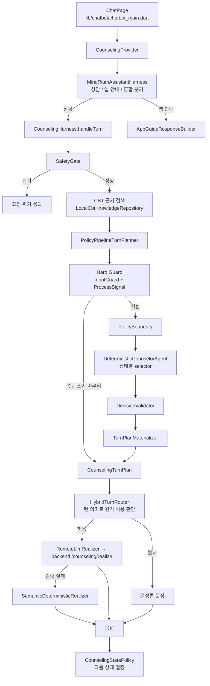

# Mindrium 디지털 CBT 상담 챗봇: 구조와 기능

기준: 태그 `counseling-v1.2-session-flow` (2026-10-02). 이 문서는 현재 구현의 유일한 기준 문서입니다. 단계별
개발 기록(Phase 8~13)은 git 기록에 남아 있습니다(`git log -- docs/counseling`).

이 기능은 의료 진단이나 전문 치료를 대체하지 않습니다. 안전 관문은 키워드 기반이고, 상담 문장과 위기 응답은
아직 임상 전문가의 검수를 받지 않았습니다. 외부 사용자에게 공개하기 전에 검수가 필요합니다.

---

## 1. 한눈에 보기

| 항목 | 내용 |
|---|---|
| 목적 | 범불안 CBT 프로그램(1~8주차) 사용자가 걱정 하나를 골라, 짧은 상담 세션에서 생각을 살펴보고 그 주차까지 배운 기법을 적용하도록 돕는다 |
| 대화 단위 | 세션 하나는 확인 → 탐색 → 되짚기 → 기법 → 마무리 순서로 진행하며, 보통 7~12턴이다 |
| 의사결정 | 무엇을 말할지(상태, 목표, 기법, 대상)는 **모두 결정론 코드**가 정한다 |
| 표현 | 일반 상담 턴의 문장만 원격 GPT가 자연스럽게 다듬을 수 있다. 검증에 실패하면 결정론 문장으로 되돌아간다 |
| 안전 | 위기 표현은 상담을 중단하고 고정된 위기 응답을 낸다 |
| 기법 | 승인된 4~8주차 기법만 사용한다. 현재 주차까지 누적해 쓰고, 미래 주차 기법은 쓰지 않는다 |
| 저장 | 세션 요약을 백엔드(`/counseling-sessions`)에 저장한다. 마무리가 확정되면 `completed`, 중간에 나가면 `interrupted` |

---

## 2. 전체 구조



**핵심 원칙**
1. **결정과 표현의 분리.** 상태 전이, 질문 목표, 기법 선택, 인용 대상은 결정론 코드가 정합니다. GPT는 이미 정해진 계획의 문장만 다듬습니다.
2. **원격 GPT 허용은 턴의 의미가 정한다.** 상태가 아니라 턴의 종류로 판단합니다. 복구 턴, 목표 소진 대응, 조기 마무리 턴은 항상 결정론 문장으로 나갑니다.
3. **흐름은 검출보다 구조로 지킨다.** 메타 발화나 저정보 답을 알아보지 못해도, 인용·기법 인정·질문 반복을 막는 안전장치가 별도로 동작합니다(8절).

---

## 3. 디렉터리와 파일

### 3.1 상담 엔진 `lib/features/counseling/`

| 파일 | 역할 |
|---|---|
| `counseling_harness.dart` | 한 턴 처리의 진입점(`handleTurn`). 안전 관문 → 검색 → 계획 → 라우팅 → 실현 → 상태 전이. `deterministic()` / `remoteGpt()` 두 팩토리 |
| `counseling_provider.dart` | 화면과 harness를 잇는 상태 관리. 메시지 목록, 세션 저장(`completed`/`interrupted`), 종료 여부(`isSessionFinalized`) |
| `counseling_state.dart` | 상태 enum과 `CounselingStatePolicy`(단계별 예산, 최소 턴, 완료 기반 전이, 조기 마무리, 마무리 재개) |
| `turn_plan.dart` | `CounselingTurnPlan` 모델, Hard Guard 계층(`DeterministicInputGuardTurnPlanner`, `DeterministicProcessSignalTurnPlanner`), 상태별 결정론 planner |
| `intervention_registry.dart` | 승인 기법 목록(4~8주차)과 `policiesUpTo(week)` 누적 조회 |
| `hybrid_turn_router.dart` | 이번 턴에 원격 GPT를 써도 되는지 판단 |
| `remote_llm_realizer.dart`, `response_realizer.dart` | 원격 실현 요청·검증·결과 모델 |
| `safety_gate.dart` | `KeywordSafetyGate`(normal / elevated / crisis) |
| `surface_variation.dart` | 같은 문장이 연달아 나오지 않게 후보 문장을 고르는 장치 |
| `prompt_builder.dart`, `turn_plan_prompt_builder.dart`, `compact_prompt_builder.dart`, `output_parser.dart`, `llm_service.dart`, `mock_llm_service.dart` | 모델 입출력 계층. 현재 제품 경로에서는 결정론 초안과 원격 실현기가 주로 쓰고, 이 계층은 프롬프트 번들과 파싱을 맡는다 |
| `empathy_planner.dart`, `activity_recommendation.dart`, `counseling_benchmark.dart` | 즉시 공감 문장(현재 비활성), 기법별 앱 활동 추천, 개발용 지연 계측 |

### 3.2 정책 계층 `lib/features/counseling/policy/`

| 경로 | 역할 |
|---|---|
| `production_turn_planner.dart` | `PolicyPipelineTurnPlanner`: Hard Guard → 경계 → 에이전트 → 검증 → 실체화 |
| `policy_boundary.dart`, `policy_boundary_request.dart` | 이번 턴에 허용되는 행위, 목표 후보, 기법 후보(경계) |
| `deterministic_counselor_agent.dart`, `counselor_agent.dart` | 경계 안에서 결정을 고르는 에이전트 |
| `counselor_decision.dart`, `counselor_decision_validator.dart`, `decision_contract.dart` | 결정 모델, 검증, (상태, 행위)별 필수 필드 계약 |
| `selectors/` | 상태별 결정: `checkin`, `explore`, `reflect`, `intervention`, `closing` |
| `materializers/turn_plan_materializer.dart` | 결정을 실제 문장 계획으로 바꿈. 인용 규칙, 기법 문장, 통합 문장, 마무리 문장이 여기 있다 |
| `materializers/realization_spec_builder.dart`, `realization/` | 원격 실현용 의미 명세, 결정론 의미 실현기(원격 실패 시 대체) |
| `intervention_eligibility_predicates.dart` | 기법 후보 결정(`InterventionCandidateResolver`), 질문→답 추적(`InterventionProgressTracker`) |
| `turn_plan_adapter.dart` | 상태·행위별로 materializer 메서드를 고름 |
| `rollout/` | 단계적 공개 설정(`RolloutConfig`), 내부 계정 허용 목록, 원격 실현 텔레메트리 |

### 3.3 데이터 `lib/data/counseling/`, `lib/data/api/`

| 파일 | 역할 |
|---|---|
| `counseling_models.dart` | `CounselingMessage`와 턴 메타데이터 enum: `DialogueAct`, `InteractionRepairReason`, `GoalExhaustionRecovery`, `StageProgress`, `InterventionStep`, `ClosingStep`, `EarlyWrapUp` |
| `user_thought_extractor.dart` | 사용자 발화 해석 규칙: 생각 형태, 저정보 답, 대상 자격(`TargetEligibility`), 라운드, 인용 가능 여부, 기법 답 판정 |
| `local_cbt_knowledge_repository.dart`, `cbt_knowledge_repository.dart` | `assets/counseling/knowledge/week0~8.json` CBT 코퍼스 검색 |
| `mindrium_context_builder.dart`, `previous_session.dart`, `retrieval_summary.dart`, `counseling_session_summary.dart` | 사용자 기록(일기, 효과 있었던 기법)과 이전 세션 맥락, 세션 요약 |
| `api/counseling_realize_api.dart`, `api/counseling_sessions_api.dart` | 백엔드 실현 API, 세션 저장 API |

### 3.4 어시스턴트와 화면

| 경로 | 역할 |
|---|---|
| `lib/features/assistant/` | `MindRiumAssistantHarness`: 발화를 상담 / 앱 사용 안내 / 혼합으로 분기한다. 앱 안내 검색과 응답, 혼합 응답 조합, 사용자 맥락 검색 |
| `lib/chatbot/chatbot_main.dart` | 상담 화면(`ChatPage`). harness 구성, 종료 안내 표시, 새로고침(새 세션) |
| `lib/chatbot/affective/` | 발화 감정 신호를 감지해 아바타 표정을 고름 (`affective_system.md`) |
| `lib/chatbot/services/speech_output_service.dart`, `ui/chat_bubble.dart` | 음성 출력, 말풍선 |

### 3.5 백엔드 `backend/app/routers/`

| 엔드포인트 | 역할 |
|---|---|
| `POST /counseling/realize` | 결정론 초안과 계획을 받아 GPT로 다시 표현한다(`counseling_realize.py`, 시스템 프롬프트 포함). 모델은 서버 설정 `openai_model`을 따른다 |
| `PUT /counseling-sessions/{session_id}` | 세션 요약 upsert |
| `GET /counseling-sessions` | 최근 세션 조회(이전 세션 맥락용) |

---

## 4. 한 턴의 처리 순서 (`CounselingHarness.handleTurn`)

1. **안전 관문.** 위기 표현이면 일반 상담을 멈추고 고정된 위기 응답을 냅니다. 모델은 호출하지 않습니다.
2. **근거 검색.** 현재 상태의 태그로 CBT 코퍼스를 검색합니다. intervention 상태에서는 현재 주차까지의 승인 기법 항목을 id로 추가합니다.
3. **계획.** `PolicyPipelineTurnPlanner`가 `CounselingTurnPlan`을 만듭니다(5~7절).
4. **라우팅.** `HybridTurnRouter`가 원격 실현 허용 여부를 정합니다. 허용 조건은 explore/reflect 상태, 일반 상담 턴(`realizationSpec`이 있고 복구·목표 소진 대응·조기 마무리가 아님), 원격 플래그 켜짐, rollout 대상입니다.
5. **실현.** 허용되면 원격 GPT가 표현하고, 응답을 검증합니다(질문 수, 행위 등). 실패하면 결정론 의미 실현기로 대체합니다. 허용되지 않으면 결정론 문장을 그대로 씁니다.
6. **상태 전이.** `CounselingStatePolicy.next()`가 이번 턴의 행위와 `stageProgress`를 보고 다음 상태를 정합니다.
7. **메시지 기록.** 응답 메시지에 턴 메타데이터를 붙입니다(목표 id, 복구 사유, 개입 단계, 마무리 단계, 조기 마무리, 확인 질문 여부). 이후 턴의 결정은 문장이 아니라 이 메타데이터를 읽습니다.

---

## 5. 세션 상태와 전이

| 상태 | 하는 일 | 최대 턴 | 최소 턴 | 다음 상태로 가는 조건 |
|---|---|---|---|---|
| checkIn | 첫 걱정을 받아 주고 불안 정도(0~10)를 묻는다 | 1 | 1 | 1턴 후 |
| explore | 걱정되는 순간을 구체화한다 | 1 | 1 | 1턴 후 |
| reflect | 생각을 되짚는다(근거 → 다른 관점 → 가능성) | 4 | 2 | 완료 보고 + 최소 턴, 또는 최대 턴 |
| intervention | 기법 질문 → 답 → 통합 | 3 | 1 | 통합(또는 적용 가능 기법 없음) 완료 시 |
| closing | 마무리 제안 → 확정 또는 1회 계속 | 세션 상한 | - | 계속하기면 reflect로 1회 복귀 |

- **세션 상한:** 20턴. 넘으면 closing으로 갑니다.
- **완료 기반 전이 (Phase 13):** reflect와 intervention은 턴 수가 아니라 계획이 보고하는 `StageProgress`로 넘어갑니다. 복구 턴은 완료로 세지 않습니다.
- **조기 마무리 (`StageProgress.wrapUp`):** 어느 단계에서든 closing으로 갑니다(8.4절).
- **알 수 없는 입력:** 진행으로 세지 않습니다. 단, explore/reflect에서 단계 최대 턴에 닿으면 넘어갑니다.

### 5.1 마무리 핸드셰이크
- 기법 통합, 적용 가능 기법 없음, 조기 마무리 턴은 모두 같은 제안으로 끝납니다: "오늘은 여기까지 정리해 볼까요, 아니면 조금 더 이야기하고 싶으신가요?"
- **확정(finalized):** 동의 표현("네", "정리하자", "여기까지", "마무리" 등), 빈 답, 저정보 답("몰라")입니다. 세션을 `completed`로 저장하고, 화면에 종료 안내를 띄웁니다.
- **계속(continued):** "아직", "더 이야기", "좀 더 들어줘" 같은 계속 의사나 새 내용입니다. reflect로 돌아가 **새 라운드**를 시작합니다. 세션당 1회만 허용됩니다.
- **계속하기를 이미 쓴 경우:** 이후의 계속·추가 요청에는 그 마음을 인정하고, 새 상담을 시작하는 방법을 안내하며 마무리합니다.
- **제안 직후 불만**("왜 계속 같은 말해"): 사과하고 더 묻지 않고 마무리합니다.
- **제안 직후 헷갈림**("무슨 말이야"): 제안을 쉬운 말로 다시 묻고, 제안은 대기 상태로 유지합니다.
- **종료 후 추가 입력:** 새로고침 안내를 번갈아 내보냅니다.

### 5.2 라운드
계속하기 이후부터는 새 라운드입니다. reflect 질문 목표의 사용 여부, 대상 걱정, 내용 검색은 **현재 라운드 기준**으로
셉니다(`UserThoughtExtractor.currentRound`). 그래서 다시 열린 라운드도 새 걱정에 대해 근거 → 다른 관점 질문을
처음부터 진행합니다.

---

## 6. 결정 계층

### 6.1 Hard Guard (일반 결정보다 먼저 실행)

**입력 검사 (`DeterministicInputGuardTurnPlanner`):** 잡음 입력(자판 연타, 의미 없는 자모열), 챗봇에 대한 욕설,
부적절한 요청, 프롬프트 우회 시도를 걸러 다시 말해 달라고 청합니다. 1~3자의 자음 채팅 약어("ㅇㅇ", "ㄴㄴ",
"ㅁㄹ")는 잡음이 아니라 짧은 답으로 봅니다. 마무리 제안이 대기 중이면 제안을 다시 묻고 대기를 유지합니다.

**대화 반응 처리 (`DeterministicProcessSignalTurnPlanner`):** 상담 내용이 아니라 대화 자체에 대한 발화를 처리합니다.

| 복구 사유 | 예시 | 대응 |
|---|---|---|
| `stopQuestioning` | "질문 좀 그만해", "그냥 들어줘" | 질문 없이 들어 주는 문장 |
| `processFrustration` | "이거 해서 뭐가 바뀌는데", "이 상담 별로 도움 안 돼요" | 회의감을 인정하는 문장 |
| `repeatedQuestion` | "왜 같은 말을 해?", "같은 거 계속 물어보네", "몇 번을 말해야 돼" | 반복을 인정하고 이어 가겠다는 문장 |
| `assistantNotUnderstood` | "무슨 말이야", "뭐라는거야", "다시 설명해 줘", "질문이 너무 어려워요" | "제 말이 헷갈리게 들렸나 봐요." + 대기 중이던 질문을 쉬운 말로 다시 물음 |

- **검출 방식:** 단일 키워드가 아니라 단서를 조합합니다. 예를 들어 "챗봇 말을 가리키는 단서 + 이해 못함 단서"가 함께 있어야 합니다.
- **오탐 방지:** 제3자 주어("선생님이 무슨 말 하는지 모르겠어"), 사용자 자신의 반복("제가 왜 같은 말을 자꾸"), 다른 사람에게 질문을 받는 상황("면접에서 같은 질문을 받을까 봐")은 걱정 내용으로 남깁니다.
- **메타 발화 제외:** 복구로 처리한 발화는 이후 인용, 대상, 요약 어디에도 쓰지 않습니다(`semanticContent`).
- **closing 상태:** 이 계층은 꺼져 있고, 5.1절의 제안 관련 처리만 동작합니다.

**조기 마무리 (`EarlyWrapUp`):** 8.4절을 보세요.

### 6.2 일반 결정 (상태별 selector)

| 상태 | selector가 정하는 것 |
|---|---|
| checkIn | 첫 발화를 받아 주고 불안 정도 질문 |
| explore | 걱정되는 순간을 묻는 질문. 불안 점수 답이면 그 점수를 인정 |
| reflect | 아직 쓰지 않은 질문 목표(근거 → 다른 관점 → 가능성)와 대상 생각. 쓸 생각이 없으면 확인 질문(clarify). 목표를 다 쓰면 목표 소진 대응(정리 또는 들어 주기) |
| intervention | 대기 중인 기법 질문이 있으면 그 답의 통합. 없으면 기법 후보를 골라 기법 질문. 후보가 없으면 정리(noEligible) |
| closing | 마무리 단계(확정 / 계속)와 마무리 문장 |

**검증:** 결정은 `decision_contract.dart`의 (상태, 행위)별 필수 필드 계약을 통과해야 실체화됩니다.

---

## 7. 개입 기법

| 주차 | 기법 (`InterventionType`) | 코퍼스 id | 적용 조건 |
|---|---|---|---|
| 4 | 균형 잡힌 생각 (`balancedThought`) | `week4_alternative_thought_01` | 항상 |
| 5 | 회피·직면 패턴 (`behaviorPatternReview`) | `week5_confront_avoid_01` | 항상 |
| 6 | 단기·장기 결과 (`consequenceReview`) | `week6_short_long_term_01` | 항상 |
| 7 | 회피의 이득과 손실 (`gainLossReview`) | `week7_gain_lose_01` | 회피 형태의 발화일 때 |
| 8 | 유지 계획 (`maintenanceReview`) | `week8_maintenance_01` | 유지 형태 발화 또는 효과 기록이 있을 때 |

- **누적 사용:** 현재 주차까지의 승인 기법 중 가장 최근 것부터, 이번 세션에 쓰지 않았고 조건을 만족하는 첫 기법을 씁니다. 미래 주차 기법은 쓰지 않습니다.
- **1~3주차:** 승인된 기법이 없습니다. 항상 적용 가능 기법 없음(noEligible) 경로로 짧게 정리하고 마무리를 제안합니다. 코퍼스에 `week3_alternative_thought_01`이 있지만 승인된 것은 아닙니다. 승인은 임상 검수 후 결정합니다.
- **순서: 질문 → 답 → 통합.**
  1. 기법 질문 턴(`InterventionStep.prompt`)은 진행 중으로 보고합니다.
  2. 다음 턴에 그 답을 통합합니다(`integration`).
  3. 통합은 답을 그대로 인용하지 않고, 기법의 관점에서 인정한 뒤 마무리를 제안합니다.
- **기법 대상:** 이번 라운드의 걱정 생각입니다(8.2절). 행동 계열 기법(5~7주)은 사용자가 실제 행동을 말했을 때만 그 행동을 대상으로 삼습니다. 그렇지 않으면 "그 걱정이 들 때 보통 어떻게 하시나요?"처럼 걱정에 붙여 묻습니다.
- **reflect 답 받기:** 기법 질문 직전 턴이 reflect 질문이었다면, 그 답을 인용 없이 먼저 받아 줍니다. 예: "말씀해 주신 생각도 함께 담아 둘게요."

---

## 8. 사용자 발화 해석 규칙과 흐름 안전장치

규칙은 대부분 `lib/data/counseling/user_thought_extractor.dart`에 있습니다.

### 8.1 발화 분류
- **저정보 답 (`isLowInformation`):** 숫자 답, 채움말, "모르겠어" 류입니다. 문장 전체를 목록과 맞추는 판정과 토큰 단위 판정을 함께 씁니다. 토큰 단위 판정은 발화가 채움말("음", "그냥", "별로", "아무")과 '모름/없음/동의' 서술어로만 이루어졌는지 봅니다.
- **답이 아님 (`isNonAnswer`):** 저정보 답 중 숫자가 아닌 것입니다. 숫자는 불안 점수 답이라 제외합니다.
- **생각 형태 (`thoughtShaped`):** 다음 형태입니다.
  - "~것 같아"
  - "~할까 봐"
  - "~면 어떡하지"
  - "X가 마음에 걸려"
  - "~라는 생각"
  - 의심형 걱정: "~건 아닐까 걱정돼", "몸이 안좋은걸까"
- **챗봇에게 하는 말 (`addressesCounselor`):** 다시·쉽게 말해 달라는 요청, 무엇을 원하는지 되묻는 말, 이해 못함 표현입니다.

### 8.2 대상 자격 (`TargetEligibility`)

| 분류 | 기법 대상 |
|---|---|
| `worryThought` (걱정 생각) | 가능 |
| `situation` (상황 서술) | 생각 대상으로 쓰지 않음 |
| `interaction` (대화 자체에 대한 말) | 불가 |
| `lowInformation` (저정보) | 불가 |

**라운드 걱정 (`roundWorryThought`):** 라운드의 첫 목표 질문 이전 발화 중 걱정 생각으로 분류되는 가장 최근 것입니다.
목표 질문이 없으면 라운드 전체에서 고릅니다. 첫 메시지에서 말한 걱정도 여기에 포함되어, reflect가 이 걱정을 대상으로
진행합니다. 여러 문장으로 된 메시지는 생각 형태인 문장만 씁니다.

### 8.3 인용 규칙
- **reflect, 복구, 기법 문장 (`isQuotable`):** **걱정 생각인 발화만** 인용합니다.
- **check-in/explore (`hasContent`):** 내용 있는 발화만 인용합니다. 저정보 답이나 챗봇에게 하는 말은 인용하지 않습니다.
- **인용할 수 없을 때:** 인용 없는 문장으로 받습니다. 예: "그 이야기를 들으니 지금 느끼시는 마음이 더 잘 이해가 돼요."

### 8.4 흐름 안전장치

| 장치 | 동작 |
|---|---|
| 기법 성과 인정 조건 | 기법 답 통합에서 성과를 말하는 문장은 다음을 모두 만족할 때만 씁니다. (1) 내용이 있음 (2) 챗봇에게 되묻는 형태가 아님 (3) 해당 기법을 수행한 흔적이 있음. 균형 사고면 "~지만/~해도/~수도", 회피·직면이면 "피하/마주" 같은 표지입니다. 저정보 답에는 "바로 떠오르지 않아도 괜찮아요"를 쓰고, 그 밖에는 성과를 말하지 않는 중립 문장을 씁니다 |
| 저정보 답 연속 | explore/reflect에서 답이 아닌 발화가 두 번 연속이면 더 묻지 않고 마무리를 제안합니다(`EarlyWrapUp.lowInformation`) |
| 헷갈림 연속 | 헷갈림 복구가 두 번 연속이면 마무리를 제안합니다(`notUnderstood`) |
| 진전 없음 | reflect에서 확인 질문이 이미 두 번 이어졌고, 라운드에 쓸 걱정이 없고, 이번 발화도 걱정을 말하는 긴 발화가 아니면 마무리를 제안합니다(`noProgress`) |
| 불만 인정 | 조기 마무리 턴에 불만이 섞여 있으면 "계속 질문이 이어져서 답답하셨을 것 같아요."로 시작합니다 |
| 반복 방지 | 같은 문장이 연달아 나오지 않게 후보를 바꿉니다. 저정보 답에 대한 문장이 두 번 이어지면 다른 문구를 씁니다 |

---

## 9. 표현 계층 (원격 GPT)

- **실행 조건:**
  - 빌드 플래그 `COUNSELING_REMOTE_REALIZER=true`가 켜져 있어야 합니다(기본은 꺼짐). 긴급 차단은 `COUNSELING_REMOTE_REALIZER_KILL_SWITCH`로 합니다.
  - 공개 단계(`RolloutStage`)를 통과해야 합니다. 단계는 `off` → `internalOnly`(내부 계정 허용 목록) → `pilot`(비율 공개)이며, 현재는 `internalOnly`입니다.
  - 라우터가 일반 상담 턴으로 판단해야 합니다(4절).
- **요청:** 결정론 초안, 반영 대상, 질문 목표, 필수 행위, 금지 사항, 최근 대화(현재 사용자 발화 포함), 허용 CBT 근거를 백엔드 `/counseling/realize`로 보냅니다.
- **검증:** 질문 수나 행위가 계획과 다르면 거부하고, 결정론 의미 실현기로 대체합니다.
- **텔레메트리:** 원격 시도 여부, 수락 여부, 실패 사유, 지연을 기록합니다. 사용자 문장 내용은 기록하지 않습니다. 현재는 로컬 로그로만 남깁니다.
- 자세한 연동 계약은 [`remote_gpt_realizer_integration.md`](remote_gpt_realizer_integration.md)를 보세요.

---

## 10. 안전 관문

- **구현:** `KeywordSafetyGate`가 사용자 발화를 `normal` / `elevated` / `crisis`로 분류합니다.
- **crisis:** 일반 상담을 멈추고 고정된 위기 응답을 냅니다. 모델과 rollout을 거치지 않습니다.
- **한계:** 키워드 기반입니다. 임상 배포 전에 위기 표현 범위와 응답 문구를 전문가가 검수해야 합니다.

---

## 11. 화면, 맥락, 저장

- **화면 (`ChatPage`):**
  - 마무리가 확정되면 종료 안내를 띄웁니다. 새로고침(↻)으로 새 세션을 시작합니다.
  - 아바타 표정은 감정 신호로 정합니다([`affective_system.md`](affective_system.md)).
  - 음성 출력을 지원합니다.
- **맥락:** `MindriumContextBuilder`가 사용자 일기, 효과 있었던 기법, 이전 세션 요약을 모읍니다. 일기의 생각은 reflect와 균형 사고의 대상 후보로 쓰입니다.
- **저장:**
  - 마무리가 확정되는 턴에 세션 요약을 `completed`로 저장합니다. 화면을 나가면 `interrupted`로 저장합니다.
  - 마무리 제안만으로는 `completed`로 저장하지 않습니다.
  - 요약 형식은 [`session_summary_schema.md`](session_summary_schema.md)를 보세요.
- **어시스턴트 분기:** 앱 사용 질문("ABC 일기는 어디서 써?")은 앱 안내 응답으로, 상담 발화는 상담으로, 둘이 섞이면 혼합 응답으로 처리합니다.

---

## 12. 빌드와 실행

| 플래그 (`--dart-define`) | 기본값 | 뜻 |
|---|---|---|
| `API_BASE_URL` | 빌드 설정값 | 백엔드 주소 |
| `COUNSELING_REMOTE_REALIZER` | `false` | 원격 GPT 표현 사용 |
| `COUNSELING_REMOTE_REALIZER_KILL_SWITCH` | `false` | 원격 표현 즉시 차단 |

**실기기 dogfood:** 개발 Mac의 IP가 자주 바뀌므로, adb 포트 포워딩을 걸고 로컬 주소로 빌드합니다. 포워딩은 무선 디버깅이 다시 연결되면 새로 걸어야 합니다.

```bash
adb -s <device> reverse tcp:8090 tcp:8090
flutter build apk --debug \
  --dart-define=COUNSELING_REMOTE_REALIZER=true \
  --dart-define=COUNSELING_REMOTE_REALIZER_KILL_SWITCH=false \
  --dart-define=API_BASE_URL=http://127.0.0.1:8090
adb -s <device> install -r build/app/outputs/flutter-apk/app-debug.apk
```

`127.0.0.1`은 `android/app/src/main/res/xml/network_security_config.xml`에서 평문 HTTP가 허용돼 있습니다.

---

## 13. 테스트와 평가

`flutter test`로 전체를 실행합니다(현재 1002개 통과).

| 묶음 | 위치 | 확인하는 것 |
|---|---|---|
| 단위·통합 | `test/counseling/*.dart` | 각 planner, selector, materializer, harness, provider, 라우터 |
| 기기 결함 재현 | `phase13_7_dogfood_regression_test.dart`, `phase13_8_*`, `phase13_9c_dev_v2_test.dart` | 실기기 dogfood에서 나온 결함(D1~3, E1~3, P1~4, 13.9A~E, 13.10)을 대화 단위로 재현 |
| 멀티턴 게이트 | `evaluation/phase12_multi_turn_regression_test.dart`, `evaluation/phase13_6_week_progression_test.dart` | 반복, 메타 발화 누락, 조기 전이, 1~8주 × 시나리오 흐름 |
| 비협조적 사용자 | `evaluation/phase13_9a_uncooperative_test.dart` | 헷갈려하는, 모른다고만 하는, 반복 지적하는, 화내는, 표기 변형 사용자와 기기 세션 재생 |
| holdout | `evaluation/phase13_9*_holdout*_test.dart`, `evaluation/fixtures/*.json` | 코드를 보지 않은 에이전트가 쓰고, 첫 실행 전에 동결한 발화로 판정. v1~v4는 이미 본 세트라 기록용이고, v5가 판정용 |
| 이전 구조 동등성 | `test/research_regression/counseling/phase8_*` | 정책 파이프라인과 기존 결정론 planner의 동등성 |

**두 층 게이트** (`evaluation/support/session_flow_metrics.dart`):

| 층 | 지표 | 기준 |
|---|---|---|
| A층 (구조) | 교착, 조기 종료, 응답 누락, 미래 주차 기법, 승인 외 CBT, noEligible 교착, 계속 요청 무시, 조기 완료, 상태 반복, 미완료, 복구 턴 원격 실현, 질문 없는 대기 (12종) | 반드시 0 |
| B층 (검출 의존) | 비답변 인정, 메타 인용, 확인 질문 반복 (3종) | 합계가 사용자 턴의 1% 이하 |

holdout v5 결과: 608턴에서 A층 0, B층 0.

**결함을 다루는 순서 (고정):**
1. 결함 발견
2. 의미 범주 정의
3. 메타데이터와 계약 정의
4. 결정론 정책 구현
5. 기기 대화 재현 테스트
6. 적대적 holdout
7. 기기 확인

holdout 발화는 고치지 않고, 이미 본 holdout은 판정에 쓰지 않습니다.

---

## 14. 알려진 한계와 다음 단계

1. **처음 보는 표현 인식:** 메타 발화와 저정보 답의 검출률이 낮습니다. holdout v5 기준으로 헷갈림 0/12, 저정보 답 2/10입니다. 지금은 8.4절의 안전장치가 피해를 막습니다. 근본 해결은 원격 모델 기반 의도 분류입니다(Phase 14 후보).
2. **원격 GPT 표현 품질:** 딱딱한 표현, 해결책 쪽으로 유도하는 질문, 한 턴에 질문 두 개가 나오는 경우가 있습니다(Phase 14).
3. **임상 콘텐츠:** 1~3주차 기법 승인, 기법 예시 문장(예시 요청에 답하기), 위기 응답과 상담 문장의 전문가 검수가 필요합니다.
4. **운영 준비:** 릴리스 빌드와 HTTPS, 원격 kill switch(현재는 빌드 플래그뿐), 서버 측 텔레메트리, 로그인 세션 만료 처리가 남았습니다.
5. **"~할 수 있을까" 형태:** "내일 시험은 잘 볼 수 있을까" 같은 의문형 걱정은 아직 생각 형태로 보지 않습니다.

---

## 15. 버전 기록

| 태그 | 내용 |
|---|---|
| `counseling-v1-clean-baseline` | 결정론 선택 + 검증된 원격 표현 + 안전한 대체 + rollout 인프라 |
| `counseling-v1.1-selection-repair` | 메타 발화 복구, 목표 소진 대응, 멀티턴 견고성 |
| `counseling-v1.2-session-flow` | 완료 기반 세션 흐름, 누적 기법, 마무리 핸드셰이크, 헷갈림·저정보 처리, 흐름 안전장치, 두 층 게이트 |
